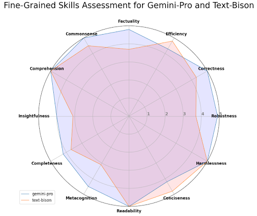

[](https://classroom.github.com/a/FF1Kikho)

# Generative AI and Large Language Model Project

## Team Members
- Srishti Chouhan (schouhan)
- Bhaavanaa Thumu (bthumu)

## Topic 
Use Case #2 - Provide up-to-date weather information (and forecasts)

## Video URL
[https://drive.google.com/file/d/1yOKbzuTJBiGGEi0GAfaIafzGKsGQtLo9/view?usp=drive_link](https://drive.google.com/file/d/1yOKbzuTJBiGGEi0GAfaIafzGKsGQtLo9/view?usp=drive_link)

## Files

- [application.py](https://github.com/14-825-GenAI-and-LLM/course-project-Srishti-Chouhan/blob/main/application.py): Code file for the app

This file contains the code for Streamlit web application that utilizes the OpenWeatherMap API and Vertex AI models namely gemini-pro and text-bison(@001) to display current weather information and weather forecasts for a selected city, and uses LangChain to generate descriptive responses based on templates for weather-related prompts.

- [models_eval.ipynb](https://github.com/14-825-GenAI-and-LLM/course-project-Srishti-Chouhan/blob/main/models_eval.ipynb): Code for comparing the two models

This notebook contains the code for evaluating the two language models (text-bison and gemini-pro) using gpt-4 through prompts, obtaining scores for their responses, and for generating a radar plot comparing their performance across various dimensions, providing a fine-grained assessment.


## Required Libraries:

Create a conda environment with the following libraries-
- python 3.9.18
- streamlit 1.31.1
- google-cloud-aiplatform 1.43.0
- langchain-google-vertexai 0.1.0
- langchain 0.1.9

The detailed list of all the libraries that have been installed while installing these main libraries are present in the requirements.txt file on our project GitHub.


## Variables to be updated/replaced:
In [application.py](https://github.com/14-825-GenAI-and-LLM/course-project-Srishti-Chouhan/blob/main/application.py)
1. [ENTER_YOUR_OPENWEATHERMAP_API_KEY](https://github.com/14-825-GenAI-and-LLM/course-project-Srishti-Chouhan/blob/f8eacf3f3641aaabe0810fc2dd027a464c6b1646/application.py#L11C1-L11C23)
2. [ENTER_LOCATION_OF_KEY_JSON_FILE](https://github.com/14-825-GenAI-and-LLM/course-project-Srishti-Chouhan/blob/f8eacf3f3641aaabe0810fc2dd027a464c6b1646/application.py#L12)
3. [ENTER_PROJECT_ID](https://github.com/14-825-GenAI-and-LLM/course-project-Srishti-Chouhan/blob/f8eacf3f3641aaabe0810fc2dd027a464c6b1646/application.py#L13C15-L13C31)
4. [ENTER_REGION](https://github.com/14-825-GenAI-and-LLM/course-project-Srishti-Chouhan/blob/f8eacf3f3641aaabe0810fc2dd027a464c6b1646/application.py#L14)
5. [ENTER_BUCKET_URI](https://github.com/14-825-GenAI-and-LLM/course-project-Srishti-Chouhan/blob/f8eacf3f3641aaabe0810fc2dd027a464c6b1646/application.py#L15C16-L15C32)

## Steps to run the application
- Create the environment as mentioned in the "Required libraries" section and activate the environment.
- Update the variables in the [application.py](https://github.com/14-825-GenAI-and-LLM/course-project-Srishti-Chouhan/blob/main/application.py) and [models_eval.ipynb](https://github.com/14-825-GenAI-and-LLM/course-project-Srishti-Chouhan/blob/main/models_eval.ipynb) files as mentioned in the "Variables to be updated/replaced" section.
- Run the application.py file using the following command to use the application-
  ```bash
  streamlit run application.py --client.showErrorDetails=false
- To evaluate the two models, run all the cells present in the [models_eval.ipynb](https://github.com/14-825-GenAI-and-LLM/course-project-Srishti-Chouhan/blob/main/models_eval.ipynb) file in a sequential manner.


## Evaluation
We have used the Gemini-Pro and Text-Bison models from Vertex AI for the task of retrieving current weather and forecasts. To assess and compare their performance, we employed the GPT-4 model as an evaluator or ground truth model. 

While performing our task without incorporating weather API information, we noticed a tendency for the language models (LLMs) to hallucinate and generate imagined weather conditions. But, we observed that the output format remained consistent both before and after the inclusion of weather information. Hence, we opted to evaluate the models without relying on weather API data, due our interest in assessing the output format rather than specific weather values.

We evaluated the models using various weather prompts, assessing them on twelve metrics: Robustness, Correctness, Efficiency, Factuality, Commonsense, Comprehension, Insightfulness, Completeness, Metacognition, Readability, Conciseness, and Harmlessness. This approach allowed us to gain insights into the models' performance across a spectrum of attributes while bypassing the influence of external weather data.



The plot of the evaluation highlights that, overall, Gemini-Pro outperforms Text-Bison. While Text-Bison performs well in conciseness and efficiency, Gemini-Pro demonstrates a better performance in Factuality, Correctness, Robustness, Metacognition, Completeness, Insightfulness, and Commonsense, and performs comparably to Text-Bison in Harmlessness and Comprehension. In summary, this evaluation suggests that Gemini-Pro is more robust and accurate across a range of metrics.
